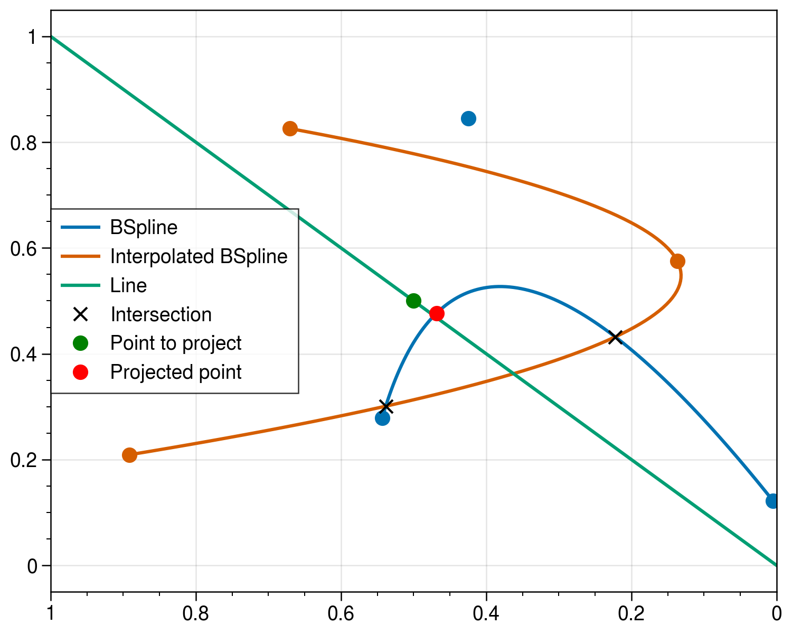

# `splines`

* Unified abstraction level for spline manipulation.
* Utilizes the `geomdl` module [1] as its base.
* Features:
  * Finding curve intersections.
  * Projection of a point to a curve.
  * Use numpy arrays as input for control points.

</img>

## References

1. https://github.com/orbingol/NURBS-Python
2. “A Primer on Bézier Curves.” Accessed: Oct. 10, 2023. [Online]. Available: https://pomax.github.io/bezierinfo
